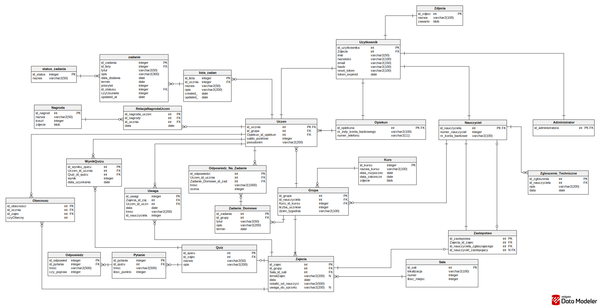

# 🚀 Wdrożenie aplikacji

## 📌 Zakres wdrożenia

Aplikacja webowa została zaprojektowana w architekturze **klient–serwer** i działa w przeglądarce internetowej. System składa się z dwóch głównych części: **frontendu**, który odpowiada za interfejs użytkownika, oraz **backendu**, który realizuje logikę biznesową i zapewnia dostęp do danych.

Wdrożenie obejmuje:
- konfigurację środowiska uruchomieniowego,
- konfigurację serwera aplikacyjnego,
- konfigurację bazy danych.

Aplikacja działa w dwóch środowiskach:
- 🧪 testowym,
- 🌍 produkcyjnym.

---

## 🏗️ Architektura systemu

System został podzielony na trzy główne warstwy, co ułatwia jego rozwój, utrzymanie oraz skalowanie.

### 🎨 Frontend 

Frontend to aplikacja internetowa uruchamiana w przeglądarce. Odpowiada za interakcję z użytkownikiem.

- komunikacja z backendem odbywa się przez **HTTP (REST API)**,
- dane przesyłane są w formacie **JSON**.

---

### ⚙️ Backend

Backend działa na serwerze aplikacyjnym i odpowiada za:
- obsługę żądań z frontendu,
- realizację logiki aplikacji,
- komunikację z bazą danych.

Backend:
- składa się z **5 mikroserwisów**,
- pełni rolę pośrednika między użytkownikiem a danymi,
- odpowiada za walidację danych oraz kontrolę dostępu.

---

### 🗄️ Warstwa danych

Warstwa danych odpowiada za przechowywanie wszystkich informacji potrzebnych do działania aplikacji.

- wykorzystywana baza danych: **PostgreSQL (Neon)**,
- dostęp do danych możliwy jest wyłącznie przez backend.

---

## 🔐 Bezpieczeństwo

- dostęp do bazy danych możliwy jest tylko przez backend,
- hasła przechowywane są w postaci **hashy**,
- komunikacja odbywa się przez **SSL**,
- baza danych posiada **automatyczne kopie zapasowe (Neon)**.

---

## ⚙️ Konfiguracja aplikacji

### 🌐 Zmienne środowiskowe – frontend (Next.js)

Zmienne dostępne po stronie klienta (prefiks `NEXT_PUBLIC_`):

```env
NEXT_PUBLIC_AUTO_API_URL=
NEXT_PUBLIC_COURSE_API_URL=
NEXT_PUBLIC_POINTS_API_URL=
NEXT_PUBLIC_QUIZ_API_URL=
NEXT_PUBLIC_USER_API_URL=
```


🖥️ Zmienne środowiskowe – backend

Plik .env:

```
DATABASE_URL=
FRONTEND_URL=
JWT_SECRET=
NODE_ENV=
PORT=
```

Opis:

DATABASE_URL – adres bazy danych PostgreSQL,
FRONTEND_URL – adres frontendu (CORS),
JWT_SECRET – klucz do podpisywania JWT,
NODE_ENV – tryb pracy (development/production),
PORT – port aplikacji.


🔗 Połączenie z bazą danych
ORM: Sequelize,
baza danych: PostgreSQL (Neon),
w środowisku produkcyjnym połączenie odbywa się przez SSL.


# Frontend
Link: https://github.com/Mickelele/frontend-public


# Diagram bazy danych



# Pełna dokumentacja:
[tekst linku](Dokumentacja.pdf)


